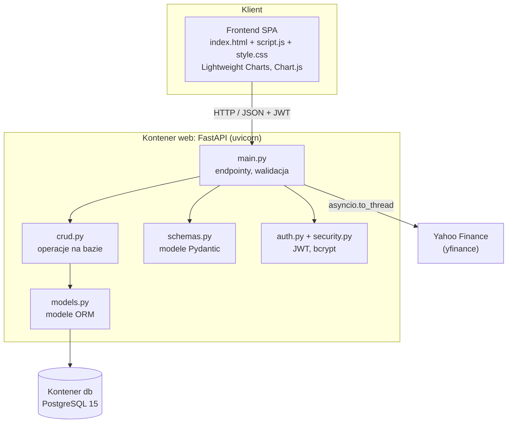
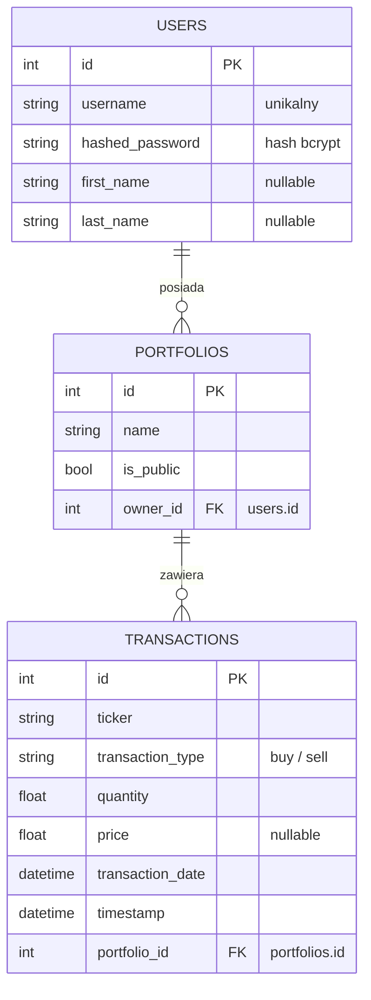
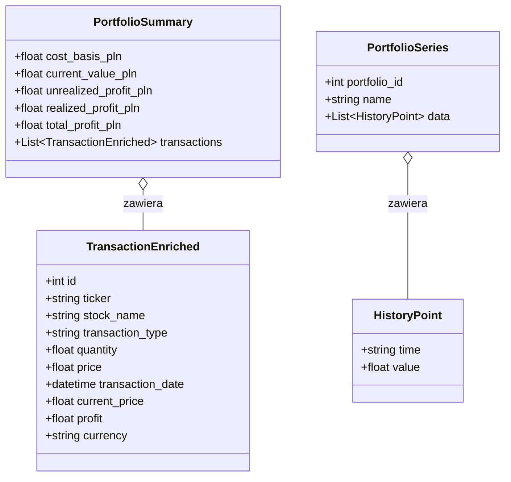

# Dokumentacja techniczna: StockPortfolio

Dokument opisuje architekturę rozwiązania, strukturę bazy danych oraz najważniejsze
zaimplementowane funkcjonalności. Instrukcja uruchomienia znajduje się w pliku `README.md`.

## Spis treści

* [Architektura](#architektura)
* [Struktura bazy danych](#struktura-bazy-danych)
* [Struktury liczone w locie](#struktury-liczone-w-locie)
* [Najważniejsze funkcjonalności](#najważniejsze-funkcjonalności)
* [Logika wyceny w PLN](#logika-wyceny-w-pln)
* [Endpointy API](#endpointy-api)
* [Bezpieczeństwo](#bezpieczeństwo)

## Architektura

Aplikacja składa się z trzech części uruchamianych razem przez Docker Compose.

Backend jest podzielony na warstwy:

* `main.py` definicje endpointów (routing, walidacja, logika wyceny `compute_summary`).
* `crud.py` operacje na bazie (zapytania SQLAlchemy).
* `models.py` modele ORM odpowiadające tabelom.
* `schemas.py` modele Pydantic (walidacja wejścia, kształt odpowiedzi).
* `auth.py` tworzenie i weryfikacja tokenów JWT, zależność `get_current_user`.
* `security.py` hashowanie i weryfikacja haseł (bcrypt).
* `database.py` asynchroniczny silnik bazy i sesje.

Baza obsługiwana jest przez `asyncpg` i `SQLAlchemy AsyncSession`.

Frontend to aplikacja (SPA) w czystym JavaScript. Wszystkie widoki istnieją
w jednym pliku `index.html` jako sekcje przełączane klasą `.hidden`, bez przeładowania strony.
Aplikacja i API działają pod tym samym adresem.

Tabele tworzone są automatycznie przy starcie aplikacji w funkcji `lifespan`.

## Struktura bazy danych

W bazie PostgreSQL trzymamy tylko dane należące do użytkownika: konta, portfele i transakcje.
Ceny i historia notowań liczone są w locie z yfinance.

Relacje:

* Jeden użytkownik ma wiele portfeli (`users.id` to `portfolios.owner_id`).
* Jeden portfel ma wiele transakcji (`portfolios.id` to `transactions.portfolio_id`).

## Inne dane

Obiekty Pydantic budowane w pamięci na podstawie transakcji
z bazy oraz danych z yfinance, zwracane jako JSON.

* `TransactionEnriched` transakcja z bieżącą ceną/zyskiem i do tego waluta.
* `PortfolioSummary` podsumowanie portfela w PLN.
* `HistoryPoint` Pierwotna wartość/punkt odniesienia portfela w PLN.

## Endpointy API

Oznaczenie (auth) znaczy, że endpoint wymaga nagłówka `Authorization: Bearer <token>`.

## Bezpieczeństwo

* Hasła nigdy nie są przechowywane jawnie, tylko jako hash bcrypt.
* Dostęp do chronionych endpointów wymaga ważnego tokenu JWT (HS256, ważny 30 minut).
* Operacje na zasobach sprawdzają właściciela (np. nie można usunąć cudzego portfela).
* Publiczne portfele są dostępne do podglądu, prywatne tylko dla właściciela.
